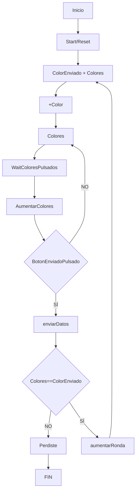
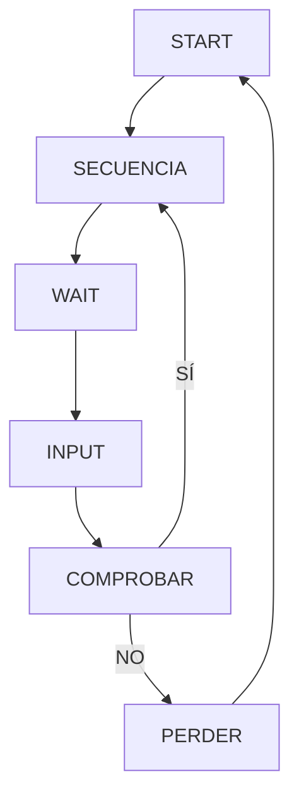

# Juego: Simón Dice

El presente proyecto tiene como finalidad desarrollar una aplicación Android llamada "Simón Dice".

## ¿Qué contiene mi app?

El interfaz gráfico contará con los siguientes componentes:

- Etiqueta con la Ronda de Juego: indica la ronda en la que se encuentra el Usuario.

- Botones de colores (azul, verde, rojo, amarillo): botones dinámicas con las que el usuario interactua.

- Botón Start/Reset: con el fin de iniciar o reiniciar la partida.

- Boton Arrow: envía la secuencia que el usuario introduce

## Estructura de la aplicación

### ***Data:***

Esta clase contiene los datos de la aplicación en variables, como la ronda, la secuencia de colores, el color enviado, etc.

Haciendo uso dela clase "Data", se puede acceder a los datos de la aplicación desde cualquier clase. Siendo algunas variables Mutables (capaces de actualizarse según la acción generada por el usuario).

### ***MyViewModel:***

En este apartado, contamos con la clase "MyViewModel", la cual se encarga de gestionar las funciones de la aplicación.

Contamos con corrutinas, las cuales se encargan de gestionar el tiempo de espera entre la secuencia de colores a visualizar, y la secuencia de colores introducida por el usuario. Haciendo más dinámica la aplicación para el usuario.

>[!TIP]
> Las corrutinas son funciones que se ejecutan de forma asíncrona, es decir, no bloquean el hilo principal de la aplicación.
>
> Estas requieren de una clase llamada "viewModelScope", la cual se encarga de gestionar el tiempo de ejecución de las corrutinas.

### ***UI:***
La clase UI es el responsable de gestionar la interfaz gráfica de la aplicación. En este caso, se encarga de gestionar los botones de colores, el botón de Start/Reset, el botón de Arrow, y la etiqueta de la ronda y el record.

La interfaz va cambiando según la ronda en la que se encuentre el usuario, y según la acción que realice el usuario. Dependiendo de la clase "MyViewModel" dada como parámetro.

### ***MainActivity:***
Finalmente, la clase "MainActivity" es la encargada de gestionar la aplicación en su totalidad. Es decir, es la clase que se encarga de gestionar el inicio de la aplicación, y de gestionar la interfaz gráfica de la aplicación.

Adicionalmente, en esta clase se encuentran funciones como MediaPlayer, las cuales se encargan de reproducir la música que escuchamos en la aplicación en bucle.

## ¿Cómo funciona la aplicación?

En la clase "MyViewModel", se encuentran los estados de la aplicación siendo alterados continuamente según la acción. Estos estados son los siguientes:
- **START**: estado inicial de la aplicación.
- **SEQUENCE**: estado en el que se muestra la secuencia de colores.
- **WAITING**: estado en el que se espera a que el usuario introduzca la secuencia de colores.
- **INPUT**: estado en el que el usuario introduce la secuencia de colores.
- **CHECKING**: estado en el que se comprueba si la secuencia de colores introducida por el usuario es correcta.
- **FINISH**: estado en el que se muestra el mensaje de fin de partida.

Con la ayuda de estos estados, se puede gestionar la aplicación de forma más dinámica, evitando así errores en la ejecución de varias funciones de manera simultánea.

Para el caso de los botones de colores, se empleó una "enum class", la cual se encarga de gestionar los colores de los botones como si de números se tratasen para identificarles. De esta forma, se puede gestionar los colores de los botones de forma más dinámica.

Y por último, la corrutina debe ser ubicada en el extracto de código que deseamos que se ejecute de forma asíncrona. En este caso, se ubica en la función "secuenciaColores", aplicando un tiempo de espera entre cada color de la secuencia. (De la misma manera empleamos la corrutina que pone el botón "blanco" al tocarlo y nuevamente recupera su color).

---

## Diagrama de flujo

## Diagrama de estado

