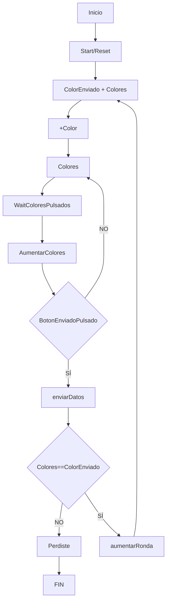
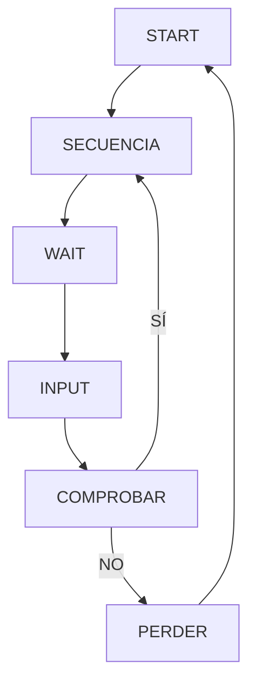

# Proceso de creación: Simón Dice

El presente proyecto tiene como finalidad desarrollar una aplicación Android llamada "Simón Dice".

## Qué contiene mi app?

El interfaz gráfico contará con los siguientes componentes:

- Etiqueta con la Ronda de Juego: indica la ronda en la que se encuentra el Usuario.

- Botones de colores (azul, verde, rojo, amarillo): botones dinámicas con las que el usuario interactua.

- Botón Start/Reset: con el fin de iniciar o reiniciar la partida.

- Boton Arrow: envía la secuencia que el usuario introduce

## Diagrama de flujo

## Diagrama de estado

